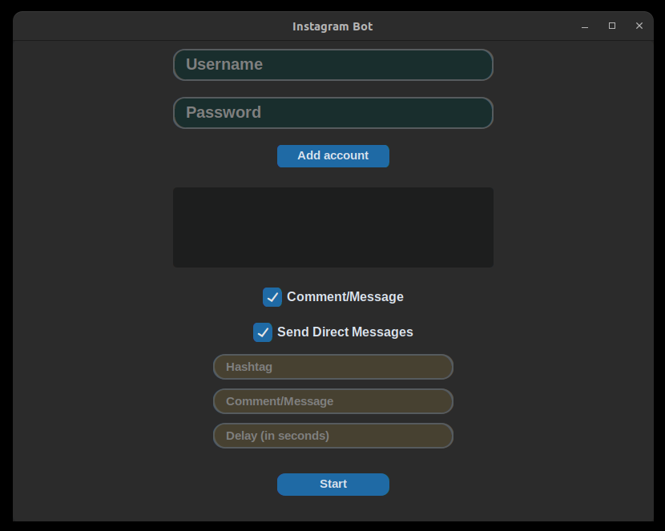

# Instagram Multi Feature Bot

## This is a Python script for automating actions on Instagram, such as sending direct messages and commenting on posts.

### Demo:

### Prerequisites:

- Python 3.x
- Selenium library
- ChromeDriver
- customtkinter

### Installation:

1. Clone the repository:
   git clone https://github.com/redianmarku/Instagram-Multi-Feature-Bot

2. Install the required dependencies:
   `pip install -r requirements.txt`

### Usage:

1. Fill in the account details and desired actions in the run.py file.

2. Run the script:

   These are the options that you can add in `python run.py` command:

   -h, --help show this help message and exit
   -a, --accounts Use multiple accounts
   -c, --comment Comment on posts
   -d, --dm Send direct messages
   -ht HASHTAG, --hashtag HASHTAG Hashtag to scrape posts from
   -cm MESSAGE, --message MESSAGE Comment or message to post
   -del DELAY, --delay DELAY Delay in seconds between actions

   Example commands:

   - `python run.py -d -cm "Hello, this is a example message" -ht "python" -del 5` The bot will start to search for users in "python" hashtag and will send a message to each of them. The delay time between each message is 5 seconds.

   - `python run.py -c -cm "Nice post" -ht "beats" -del 8 -a` The bot will start to search for users in "beats" hashtag and will comment in the most recent posts to each of them. The delay time will be 8 seconds and also when you run command bot will ask you for the account you want to use because of "-a" param.

3. Follow the prompts in the terminal to provide necessary information, such as login credentials, comments, hashtags, etc.

4. Sit back and let the bot automate the desired actions on Instagram!

### Notes:

- Make sure to use this script responsibly and in compliance with Instagram's terms of service.
- Be cautious when performing automated actions to avoid any potential account restrictions or bans.

### License:

This project is licensed under the MIT License. Feel free to contribute, open issues, and submit pull requests if you have any improvements or suggestions.
